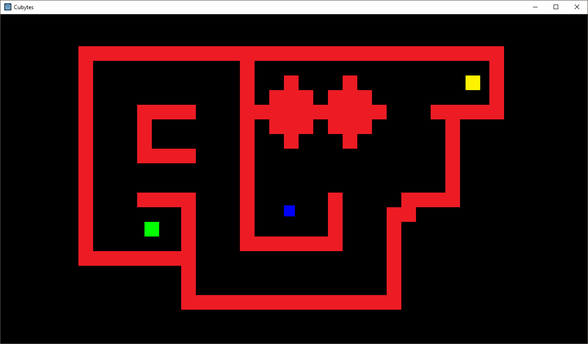

# Cubytes-Godot

## Media

## Description
A remake of Cubytes with Godot 3.0.4, instead of the Chili Framework. I'll be adding new features to it as time goes on and hopefully by the end of it create a full-featured game.

## Releases
### **Alpha 4.5:** 
- [Windows](https://github.com/Battlefrog/Cubytes-Godot/releases/download/v0.045/Cubytes_Alpha4.5_Windows.zip)
- [MacOS](https://github.com/Battlefrog/Cubytes-Godot/releases/download/v0.045/Cubytes_Alpha4.5_macOS.zip)
- [Linux](https://github.com/Battlefrog/Cubytes-Godot/releases/download/v0.045/Cubytes_Alpha4.5_Linux.zip)

### **Alpha 4:**
- [Windows](https://github.com/Battlefrog/Cubytes-Godot/releases/download/v0.04/Cubytes.-.Alpha.4.zip)

### **Alpha 3:** 
- [Windows](https://github.com/Battlefrog/Cubytes-Godot/releases/download/v.0.03/Cubytes.-.Alpha.3.zip)

### **Alpha 2:** 
- [Windows](https://github.com/Battlefrog/Cubytes-Godot/releases/download/v0.0.2/Cubytes.-.Alpha.2.zip)

### **Alpha 1:** 
- [Windows](https://github.com/Battlefrog/Cubytes-Godot/releases/download/v.0.01/Alpha.1.zip)

## Running
To run it, open the **"project.godot"** file in Godot 3.0+. Should bulid itself, provided I didn't screw everything up.

## License
Cubytes-Godot is under a MIT license. This means that you can share the program, but please keep in mind that:
* The only place for the source code is here.
* I (Battlefrog) still maintain the copyright, so you should respect it.

