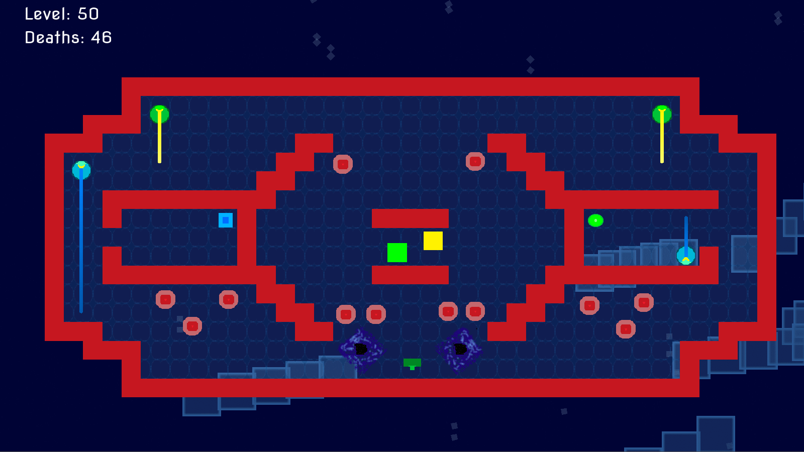

# Cubytes-Godot

## Media

## Description
A remake of Cubytes (formerly AssaultCube) with Godot 3.0.6, instead of the Chili Framework.

It's pretty much a full-featured game at this point. Have fun.

## Releases

### **Alpha 7:** 
- [Windows (64-bit)](https://github.com/Battlefrog/Cubytes-Godot/releases/download/0.07/Cubytes_Alpha7_Windows64.zip)
- [Windows (32-bit)](https://github.com/Battlefrog/Cubytes-Godot/releases/download/0.07/Cubytes_Alpha7_Windows32.zip)
- [MacOS](https://github.com/Battlefrog/Cubytes-Godot/releases/download/0.07/Cubytes_Alpha7_macOS.zip)
- [Linux](https://github.com/Battlefrog/Cubytes-Godot/releases/download/0.07/Cubytes_Alpha7_Linux-X11.zip)

### **Alpha 6:** 
- [Windows (64-bit)](https://github.com/Battlefrog/Cubytes-Godot/releases/download/0.0.6/Cubytes_Alpha6_Windows64.zip)
- [Windows (32-bit)](https://github.com/Battlefrog/Cubytes-Godot/releases/download/0.0.6/Cubytes_Alpha6_Windows32.zip)
- [Linux](https://github.com/Battlefrog/Cubytes-Godot/releases/download/0.0.6/Cubytes_Alpha6_Linux.zip)

### **Alpha 5:** 
- [Windows (64-bit)](https://github.com/Battlefrog/Cubytes-Godot/releases/download/0.0.51/Cubytes_Alpha5.1_Windows64.zip)
- [Windows (32-bit)](https://github.com/Battlefrog/Cubytes-Godot/releases/download/0.0.51/Cubytes_Alpha5.1_Windows32.zip)
- [MacOS](https://github.com/Battlefrog/Cubytes-Godot/releases/download/0.0.51/Cubytes_Alpha5.1_MacOS.zip)
- [Linux](https://github.com/Battlefrog/Cubytes-Godot/releases/download/0.0.51/Cubytes_Alpha5.1_Linux.zip)

### **Alpha 4.5:** 
- [Windows (64-bit)](https://github.com/Battlefrog/Cubytes-Godot/releases/download/v0.045/Cubytes_Alpha4.5_Windows.zip)
- [MacOS](https://github.com/Battlefrog/Cubytes-Godot/releases/download/v0.045/Cubytes_Alpha4.5_macOS.zip)
- [Linux](https://github.com/Battlefrog/Cubytes-Godot/releases/download/v0.045/Cubytes_Alpha4.5_Linux.zip)

### **Alpha 4:**
- [Windows (64-bit)](https://github.com/Battlefrog/Cubytes-Godot/releases/download/v0.04/Cubytes.-.Alpha.4.zip)

### **Alpha 3:** 
- [Windows (64-bit)](https://github.com/Battlefrog/Cubytes-Godot/releases/download/v.0.03/Cubytes.-.Alpha.3.zip)

### **Alpha 2:** 
- [Windows (64-bit)](https://github.com/Battlefrog/Cubytes-Godot/releases/download/v0.0.2/Cubytes.-.Alpha.2.zip)

### **Alpha 1:** 
- [Windows (64-bit)](https://github.com/Battlefrog/Cubytes-Godot/releases/download/v.0.01/Alpha.1.zip)

## Running
To run it, open the **"project.godot"** file in Godot 3.0.6. The import settings are not being pushed, however if you'd like to import those then edit the .gitignore and remove any of the *.import.

## License
Cubytes-Godot is under the MIT license. Have fun.